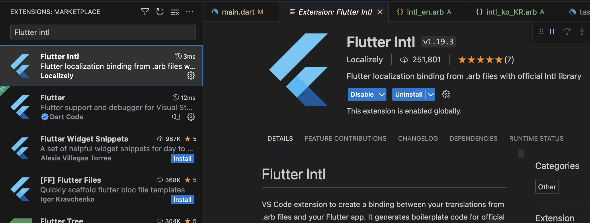

# Localization

## Background

The app should follow the user's preferred language first.&#x20;

The app should support multi-languages, so when the user changes the preferred language, it should show the changed language.

## Option 1 - Offical page&#x20;

Follow the official page guide.

* [https://docs.flutter.dev/ui/accessibility-and-localization/internationalization](https://docs.flutter.dev/ui/accessibility-and-localization/internationalization)\


## Option 2 - VSCode extension  'Flutter Intl'

Refer to the extension page - [https://marketplace.visualstudio.com/items?itemName=localizely.flutter-intl](https://marketplace.visualstudio.com/items?itemName=localizely.flutter-intl)

Follow the steps in the page.

### Add package dependency

```
flutter pub add flutter_localizations --sdk=flutter
flutter pub add intl:any
```

### In VSCode, search 'Flutter Intl' and install an extension.



In the VSCode command window

#### `Flutter Intl: Initialize` <a href="#flutter-intl-initialize" id="flutter-intl-initialize"></a>

### Modify the app widget file.

#### Add import 'generated/l10n.dart' and 'package:flutter\_localizations/flutter\_localizations.dart'

```
import 'generated/l10n.dart';
import 'package:flutter_localizations/flutter_localizations.dart';
```

#### Add \`localizationsDelegates\` and \`supportedLocales\`

```
    Widget build(BuildContext context) {
    return MaterialApp(
      title: 'MyApp',
      theme: ThemeData(
        primarySwatch: Colors.blue,
      ),
      home: const TaskListScreen(),
      debugShowCheckedModeBanner: false,
      localizationsDelegates: const [
        S.delegate,
        GlobalMaterialLocalizations.delegate,
        GlobalWidgetsLocalizations.delegate,
        GlobalCupertinoLocalizations.delegate,
      ],
      supportedLocales: S.delegate.supportedLocales,
    );
  }
```

### Modify the source file.

#### Add dependency 'package:xy\_todo/generated/l10n.dart';

```
import 'package:xy_todo/generated/l10n.dart';
```

#### Extract and add the string to the arb file.

1. Select the string to localize and tab the :bulb:button, then select `Extract to ARB`


2.  Localize the string in `*.arb` file

    `lib/l10n/intl_en.arb`

```
{
  "s_taskLists": "Task lists"
}
```

### How to add locale

In the VSCode, open command pallete

#### `Flutter Intl: Add locale` <a href="#flutter-intl-initialize" id="flutter-intl-initialize"></a>

## Reference

* Flutter official
  * [https://docs.flutter.dev/ui/accessibility-and-localization/internationalization](https://docs.flutter.dev/ui/accessibility-and-localization/internationalization)
* Flutter Intl extension
  * [https://marketplace.visualstudio.com/items?itemName=localizely.flutter-intl](https://marketplace.visualstudio.com/items?itemName=localizely.flutter-intl)
* Medium, Korean - \[Flutter] Localizations 완전 정복 하기
  * [https://jay-flow.medium.com/flutter-localizations-%EC%99%84%EC%A0%84-%EC%A0%95%EB%B3%B5-%ED%95%98%EA%B8%B0-8fa5f50a3fd2](https://jay-flow.medium.com/flutter-localizations-%EC%99%84%EC%A0%84-%EC%A0%95%EB%B3%B5-%ED%95%98%EA%B8%B0-8fa5f50a3fd2)

